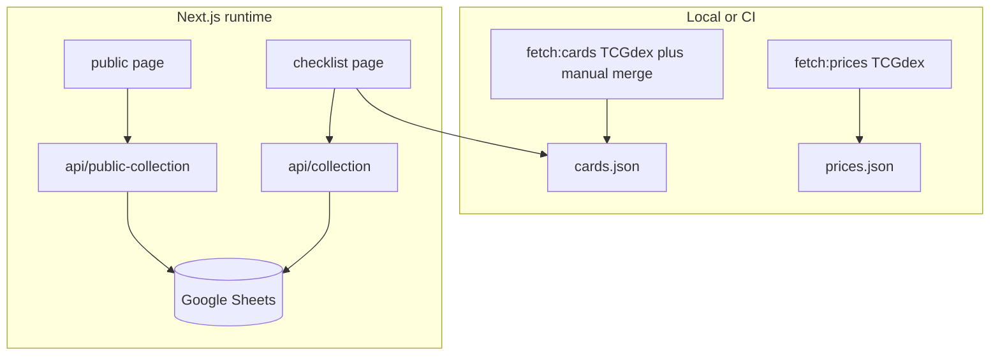

# Eevee Card Tracker

A personal **Next.js 14** application for tracking a **Pokémon TCG** collection focused on **Eevee and all Eeveelutions**. The app ships a static card catalogue and price snapshot for fast, predictable deploys, and syncs **owned cards** to **Google Sheets** behind simple username/password authentication.

---

## Data sources (TCGdex)

**Card metadata** (names, sets, types, variants, and image URLs when TCGdex provides them) and **market pricing** (where exposed in their API, e.g. TCGplayer and Cardmarket aggregates) come from the **hosted [TCGdex API](https://tcgdex.dev/)**. See the official docs at **[tcgdex.dev](https://tcgdex.dev/)** (REST endpoints, SDKs, and references).

You **do not** need to clone the TCGdex Git repository. The fetch scripts use the public API only: `scripts/fetch-cards.ts` via the **`@tcgdex/sdk`** npm package, and `scripts/fetch-prices.ts` via `https://api.tcgdex.net/v2/...`. Network access at fetch time is enough.

---

## Features

- **Catalogue** — English-language Eevee and Eeveelution cards from [TCGdex](https://www.tcgdex.net/) (data loaded through the [TCGdex API](https://tcgdex.dev/); physical TCG only; Pokémon TCG Pocket sets are excluded when rebuilding data).
- **Checklist** — Search, filter by All / Owned / Missing, estimated collection value and per-variant pricing where data exists, add and remove owned cards (including a variant picker for multi-variant printings), optional marketplace search shortcuts (eBay, TCGplayer, Cardmarket), and a full-art image modal.
- **Public showcase** — Route `/public` shows **owned cards only** in the same visual style as the checklist, without marketplace links or edit controls. Data is served from an **unauthenticated** read-only API backed by the same Google Sheet.
- **Pricing** — Market prices are populated offline from the **TCGdex REST API** ([tcgdex.dev](https://tcgdex.dev/)), e.g. TCGplayer USD and Cardmarket EUR where the API exposes them. Committed overrides in `data/manual-prices.json` fill gaps or correct values at display time.
- **Manual card overrides** — Entries in `data/manual-cards.json` replace fetched rows by **card ID** (e.g. promos, custom images, deduplicated IDs).

---

## Tech stack

| Layer | Choice |
|--------|--------|
| Framework | Next.js 14 (App Router), React 18, TypeScript |
| Styling | Tailwind CSS |
| Card data (build time) | `@tcgdex/sdk` in `scripts/fetch-cards.ts` (hosted TCGdex API) |
| Prices (build time) | `fetch` to `api.tcgdex.net` in `scripts/fetch-prices.ts` (hosted TCGdex API) |
| Collection storage | Google Sheets API (`googleapis`), service account JWT |
| Auth | Cookie-based session (HMAC-signed), credentials from environment variables |

---

## Architecture

Card and price JSON files are generated **locally or in CI** and committed (or deployed alongside the app). The running app reads `data/cards.json` and `data/prices.json`; the live collection is read and written through authenticated API routes that talk to Google Sheets.



---

## Prerequisites

- **Node.js** (LTS recommended) and npm.
- A **Google Cloud** project with the Sheets API enabled, a **service account**, and a spreadsheet that lists the service account as an editor.
- A worksheet named **`collection`**. The app reads and writes rows **A2:F** per data row: composite **card ID** (e.g. `sv1-123` or `sv1-123:holo`), **name**, **set name**, **card number**, **image URL**, **owned** (boolean). Reserve **row 1** for your own column headers; data begins at row 2.

---

## Environment variables

Copy `.env.local.example` to `.env.local` and set:

| Variable | Purpose |
|----------|---------|
| `APP_USERNAME` | Login username |
| `APP_PASSWORD` | Login password |
| `SESSION_SECRET` | Secret used to sign session cookies (**required in production** for secure sessions) |
| `GOOGLE_CLIENT_EMAIL` | Service account email |
| `GOOGLE_PRIVATE_KEY` | Service account private key (PEM; use `\n` for newlines inside the string when pasting into `.env`) |
| `GOOGLE_SHEET_ID` | Target spreadsheet ID |

In production, also rely on HTTPS so the app can mark session cookies `Secure` (see `lib/auth/session.ts`).

---

## Getting started

```bash
npm install
# Copy .env.local.example to .env.local (e.g. copy on Windows, cp on macOS/Linux).
# Edit .env.local with your credentials and sheet ID.

npm run fetch:cards   # Rebuild data/cards.json from TCGdex + manual-cards.json
npm run fetch:prices  # Rebuild data/prices.json from TCGdex

# No local clone of TCGdex is required—these commands call the public API.

npm run dev
```

Open the app in the browser. The root path redirects to `/login`; after sign-in you can use `/checklist`. The public showcase is at **`/public`** (no login required).

For production:

```bash
npm run build
npm start
```

---

## NPM scripts

| Script | Description |
|--------|-------------|
| `npm run dev` | Development server |
| `npm run build` | Production build |
| `npm run start` | Start production server |
| `npm run lint` | ESLint (Next.js) |
| `npm run fetch:cards` | Fetch Eevee / Eeveelution cards from TCGdex, merge `manual-cards.json`, write `data/cards.json` |
| `npm run fetch:prices` | Fetch pricing for cards in `cards.json` via TCGdex, write `data/prices.json` |

---

## Data files (`data/`)

| File | Role |
|------|------|
| `cards.json` | Generated catalogue. **Do not hand-edit for durability**; use `manual-cards.json` and re-run `fetch:cards`. |
| `prices.json` | Generated pricing and `_meta` (e.g. EUR→USD rate). Re-run `fetch:prices` to refresh. |
| `manual-cards.json` | Manual card definitions that **override** fetched rows with the same `id`. |
| `manual-prices.json` | Per-card or per-variant price overrides merged at read time with `prices.json` in `lib/cards.ts`. |

Nothing here depends on checking out the TCGdex source tree—only the committed JSON and the live API.

---

## Security and privacy

- **Google credentials** and session secrets are **server-only**; they must never be exposed in client-side code.
- **`/public` and `GET /api/public-collection`** return the same collection rows as the authenticated `GET /api/collection` **without login**. Anyone with the URL can see what is stored in your Sheet for the linked account. Disable or protect hosting if that exposure is unacceptable.
- Card images and third-party links in the checklist are loaded or opened by the **user’s browser**; review outbound URLs and your hosting CSP as needed.

---

## Legal notice

Pokémon, card names, and set names are trademarks of their respective owners. This project is an independent fan tool. Card and pricing data obtained from the **TCGdex API** are subject to [TCGdex](https://tcgdex.dev/) and respective data providers’ terms. This repository is maintained as a **private, personal** project unless you choose otherwise.
