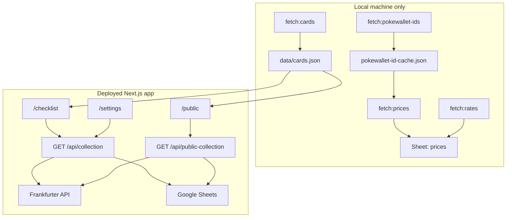

# Eevee Card Tracker

A personal **Next.js 14** app for tracking a **Pokémon TCG** collection focused on **Eevee and all Eeveelutions**.

- **Deployed web app** — read-only for data maintenance: login, checklist, public showcase, display-currency settings. No admin tools or fetch scripts in the UI.
- **Your machine** — catalogue rebuilds, Pokewallet price fetches, and Sheet seeding run locally via npm scripts.
- **Google Sheets** — live source of truth for **collection ownership** and **market prices** at runtime.
- **`data/cards.json`** — bundled at build time; redeploy when the catalogue changes.

Price and collection updates from local scripts appear after a **browser refresh** — no redeploy required for prices.

---

## Table of contents

- [Features](#features)
- [How the app works](#how-the-app-works)
  - [Deployed web app](#deployed-web-app)
  - [Local scripts (your machine)](#local-scripts-your-machine)
  - [Architecture diagram](#architecture-diagram)
  - [What updates when](#what-updates-when)
- [Display currency & exchange rates](#display-currency--exchange-rates)
- [Variant pricing rules](#variant-pricing-rules)
- [NPM scripts reference](#npm-scripts-reference)
  - [Web app](#web-app)
  - [Catalogue & data pipeline](#catalogue--data-pipeline)
  - [Pricing pipeline](#pricing-pipeline)
  - [Tests](#tests)
  - [CLI flags (Pokewallet batch scripts)](#cli-flags-pokewallet-batch-scripts)
  - [`cards:pick` commands](#cardspick-commands)
- [Deprecated & legacy](#deprecated--legacy)
- [Data files (`data/`)](#data-files-data)
- [Google Sheet setup](#google-sheet-setup)
- [Environment variables](#environment-variables)
- [Getting started](#getting-started)
  - [Windows scheduled task (optional)](#windows-scheduled-task-optional)
- [App routes & API](#app-routes--api)
- [Deploy to Vercel](#deploy-to-vercel)
- [Self-host / fork](#self-host--fork)
- [One-off contributor scripts](#one-off-contributor-scripts)
- [Security & privacy](#security--privacy)
- [Legal notice](#legal-notice)

---

## Features

- **Catalogue** — English-language Eevee and Eeveelution cards from [TCGdex](https://www.tcgdex.net/) (physical TCG only; Pocket sets excluded when rebuilding data).
- **Checklist** — Search, filter All / Owned / Missing, estimated collection value, gold price chips in your chosen currency, variant picker for multi-variant printings, marketplace shortcuts (eBay, TCGplayer, Cardmarket), and a full-art image modal.
- **Public showcase** — [`/public`](#app-routes--api) shows **owned cards only**, read-only, backed by the same Google Sheet.
- **Live pricing** — Prices from the [Pokewallet API](https://www.pokewallet.io/api-docs), stored in the Sheet **`prices`** tab. Run [`fetch:prices`](#pricing-pipeline) on a schedule locally; refresh the app to see updates. Rows with `source=manual` are never overwritten by the fetch script.
- **Display currency** — [`/settings`](#app-routes--api): USD, EUR, HUF, or GBP (browser preference). FX from [Frankfurter](https://www.frankfurter.app/) at runtime.
- **Manual card overrides** — [`data/manual-cards.json`](#data-files-data) replaces fetched rows by card ID (promos, custom images, sets not in TCGdex).
- **Included extras** — [`data/included-cards.json`](#data-files-data) adds TCGdex cards beyond Eeveelution name queries. Use [`cards:pick`](#cardspick-commands) to search and add interactively.

---

## How the app works

### Deployed web app

The built app on Vercel (or `npm start`) does **only** this:

1. Serves the static catalogue from **`data/cards.json`** (committed / built into the bundle).
2. Reads **collection** and **prices** from **Google Sheets** on each API request.
3. Fetches **live exchange rates** from Frankfurter when serving collection data (1-hour server cache; Sheet meta as fallback).
4. Converts stored USD/EUR variant prices into your chosen **display currency** in the UI.

It does **not** call Pokewallet, TCGdex, or Frankfurter from the browser. It does **not** expose catalogue rebuild or price-fetch tools (the old `/admin` page was removed).

| Page | Auth | Purpose |
|------|------|---------|
| [`/checklist`](#app-routes--api) | Yes | Main tracker — toggle owned, search, filters, est. value |
| [`/settings`](#app-routes--api) | Yes | Display currency preference |
| [`/public`](#app-routes--api) | No | Owned-only showcase |
| [`/login`](#app-routes--api) | No | Session login |

### Local scripts (your machine)

All data maintenance runs **locally** with credentials in [`.env` / `.env.local`](#environment-variables):

| Step | Script | Output |
|------|--------|--------|
| Rebuild catalogue | [`fetch:cards`](#catalogue--data-pipeline) | `data/cards.json` → commit + redeploy |
| Resolve Pokewallet IDs | [`fetch:pokewallet-ids`](#pricing-pipeline) | `data/pokewallet-id-cache.json` |
| Fetch market prices | [`fetch:prices`](#pricing-pipeline) | Google Sheet `prices` tab |
| Daily price fetch (Windows) | [`setup:fetch-prices-task`](#windows-scheduled-task-optional) | Task Scheduler → Sheet `prices` tab |
| FX meta only | [`fetch:rates`](#pricing-pipeline) | Sheet `_meta` row (optional cron) |
| One-time Sheet seed | [`migrate:prices-to-sheet`](#deprecated--legacy) | From legacy JSON files |

### Architecture diagram


```mermaid
flowchart TB
  subgraph local [Local machine only]
    fetchCards["fetch:cards"]
    fetchIds["fetch:pokewallet-ids"]
    fetchPrices["fetch:prices"]
    fetchRates["fetch:rates"]
    fetchCards --> cardsJson["data/cards.json"]
    fetchIds --> cacheJson["pokewallet-id-cache.json"]
    cacheJson --> fetchPrices
    fetchPrices --> pricesTab["Sheet: prices"]
    fetchRates --> pricesTab
  end

  subgraph runtime [Deployed Next.js app]
    checklist["/checklist"]
    settings["/settings"]
    publicPage["/public"]
    apiAuth["GET /api/collection"]
    apiPublic["GET /api/public-collection"]
    frankfurter["Frankfurter API"]
    sheets["Google Sheets"]
    cardsJson --> checklist
    cardsJson --> publicPage
    checklist --> apiAuth
    publicPage --> apiPublic
    settings --> apiAuth
    apiAuth --> sheets
    apiPublic --> sheets
    apiAuth --> frankfurter
    apiPublic --> frankfurter
  end
```

### What updates when

| Data | Source | Update method | Visible in app |
|------|--------|---------------|----------------|
| Card list | `data/cards.json` | `fetch:cards` → git commit → **redeploy** | After deploy |
| Collection | Sheet `collection` tab | Checklist UI (instant) or edit Sheet | Refresh page |
| Prices | Sheet `prices` tab | `fetch:prices` locally | Refresh page |
| FX rates | Frankfurter + Sheet `_meta` | Automatic on API load; optional `fetch:rates` | Refresh page |
| Display currency | Browser `localStorage` | Settings page | Instant |

---

## Display currency & exchange rates

Card prices are stored as **USD** (TCGPlayer) and **EUR** (Cardmarket) per variant in the Sheet. The app converts at display time — nothing is stored in HUF/GBP.

**Resolution rules** ([`lib/display-price.ts`](lib/display-price.ts)) — no averaging when both USD and EUR exist:

| Display | Prefer native | Else convert from |
|---------|---------------|-------------------|
| USD | `variants.*.usd` | EUR → USD (derived from `usdRates.EUR`) |
| EUR | `variants.*.eur` | USD → EUR (derived from `usdRates.EUR`) |
| HUF / GBP | EUR path if EUR exists | else USD × `usdRates[code]` |

**Exchange rates** ([`lib/exchange-rates.ts`](lib/exchange-rates.ts)):

- **Online:** `GET https://api.frankfurter.app/latest?from=USD&to=EUR,HUF,GBP` (ECB reference data, no API key).
- **When:** [`enrichPricesSnapshot()`](lib/exchange-rates.ts) runs on every `GET /api/collection` and `GET /api/public-collection`, cached **1 hour** on the server.
- **Fallback:** Sheet `_meta` row — `ratesUpdatedAt` + `usdRatesJson` only (see [Google Sheet setup](#google-sheet-setup)). EUR/USD is derived from `usdRates.EUR` when needed.
- **Local backup:** [`fetch:prices`](#pricing-pipeline) and [`fetch:rates`](#pricing-pipeline) write the `_meta` row to the Sheet when Frankfurter is unavailable at fetch time.

**UI:** Settings (hamburger → Settings) picks currency. Each card shows a **gold value chip** on the title row; est. value uses the same logic summed over owned variant rows.

---

## Variant pricing rules

**Multi-variant cards** — strict `variantsJson` keys only (e.g. owned `firstEdition` uses `firstEdition`, not normal/holo fallbacks).

**Single-variant cards** — may alias when Pokewallet uses a different key (e.g. catalogue `holo`, API `normal` for Trainer Gallery cards). See [`lib/cards.ts`](lib/cards.ts) `resolveSingleVariantAlias`.

**Pokewallet auto-fetch** maps `normal`, `holo`, `reverse`, and `firstEdition` (USD only). Variants Pokewallet does not return (e.g. `pokeball`, `masterball`) can be added manually in the same row’s `variantsJson` — [`fetch:prices`](#pricing-pipeline) merges and **preserves** them on each run ([`lib/price-merge.ts`](lib/price-merge.ts)).

**Row `source`:**

| `source` | Behavior |
|----------|----------|
| `pokewallet` (default) | Fetch updates Pokewallet variant keys; manual-only keys in existing `variantsJson` are kept. |
| `manual` | Whole row locked — fetch skips (use for cards with no Pokewallet ID, e.g. some CBB2C). |

**Hybrid example** (Leafeon `sv8pt5-5` — keep `source=pokewallet`, add pokeball once in Sheet):

```json
{
  "holo": { "usd": 0.32, "eur": 0.30 },
  "reverse": { "usd": 0.35, "eur": null },
  "pokeball": { "usd": 12.00, "eur": 10.50 }
}
```

1. Add `pokeball` (and/or `masterball`) prices to `variantsJson` in the Sheet.
2. Run `fetch:prices` — holo/reverse refresh from Pokewallet; pokeball stays.
3. Edit pokeball in the Sheet anytime; fetch will not remove it.
4. Delete a manual variant key from JSON to drop it.

If Pokewallet ever returns a price for a key you had manually, the **fetch wins** for that key.

**Decimal formats:** Sheet `usd` / `eur` accept dot (`96.61`) and comma (`96,61`) when entered manually.

**Price chip tooltips:** Hover shows the row’s column **D** date (`updatedAt`) and column **F** source — “Fetched …” for `pokewallet`, “Entered manually …” for `manual`.

---

## NPM scripts reference

### Web app

| Script | Description |
|--------|-------------|
| `npm run dev` | Development server |
| `npm run build` | Production build |
| `npm run start` | Start production server |
| `npm run lint` | ESLint (Next.js) |

### Catalogue & data pipeline

| Script | Description |
|--------|-------------|
| `npm run fetch:cards` | Rebuild [`data/cards.json`](data/cards.json) from TCGdex + [`included-cards.json`](data/included-cards.json) + [`manual-cards.json`](data/manual-cards.json). Requires network. **Commit + redeploy** after. |
| `npm run cards:pick` | Interactive CLI to search TCGdex and edit [`included-cards.json`](data/included-cards.json). |

### Pricing pipeline

| Script | Description |
|--------|-------------|
| `npm run fetch:pokewallet-ids` | **Phase A** — resolve Pokewallet `pk_` IDs via `/search` → [`pokewallet-id-cache.json`](data/pokewallet-id-cache.json). |
| `npm run rebuild:cbb2c-map` | Re-fetch live CBB2C set from Pokewallet and rebuild [`cbb2c-pokewallet-id-map.json`](data/cbb2c-pokewallet-id-map.json) (1 API call). |
| `npm run seed:cbb2c-ids` | Seed CBB2C (Gem Pack Vol. 2) IDs from [`cbb2c-pokewallet-id-map.json`](data/cbb2c-pokewallet-id-map.json) into `pokewallet-id-cache.json` — `/search` cannot match these; no API calls. |
| `npm run fetch:prices` | **Phase B** — fetch prices via `GET /cards/:id` → Sheet **`prices`** tab. Skips rows already updated **today** (column D) and always skips `source=manual`. Use `--force` to refetch today's pokewallet rows. Merges manual variant keys (pokeball, etc.). Updates `_meta` FX from Frankfurter. |
| `npm run fetch:prices:daily` | Same as `fetch:prices`, wrapped for daily automation — skips if already succeeded today ([`run-fetch-prices-daily.ps1`](scripts/run-fetch-prices-daily.ps1)). |
| `npm run setup:fetch-prices-task` | Register Windows Task Scheduler job (daily 7 AM + log-on catch-up). See [Windows scheduled task](#windows-scheduled-task-optional). |
| `npm run fetch:rates` | Update Sheet **`_meta`** row with Frankfurter FX only (no Pokewallet calls). Handy for daily cron without a full price fetch. |
| `npm run test:pokewallet-prices` | Dry-run Pokewallet search + pricing on 3 random cards or `--cards id1,id2`. |

**Recommended pricing sequence:**

```bash
npm run test:pokewallet-prices          # validate matching
npm run fetch:pokewallet-ids -- --only-missing
npm run fetch:prices                    # full catalogue with auto pacing
```

**Self-pacing:** omit `--limit` and the Pokewallet client bursts until the hourly/daily window is full, waits, then continues ([`scripts/pokewallet-client.ts`](scripts/pokewallet-client.ts)). ~530 cards uses several hourly bursts on the free tier.

**Same-day skip:** rerunning `fetch:prices` the same day only calls Pokewallet for cards whose Sheet `updatedAt` is missing or older than today. Partial batches (`--offset` / `--limit`) can be resumed without re-fetching cards already priced today. Pass `--force` to refetch all pokewallet rows anyway (manual rows are never fetched).

```bash
# Manual hourly batches (optional)
npm run fetch:prices -- --limit 100 --offset 0
npm run fetch:prices -- --limit 100 --offset 100   # skips cards from first batch if same day
npm run fetch:prices -- --force                    # refetch all pokewallet rows today
```

**Gem Pack Vol. 2 (CBB2C):** Pokewallet lists the set as `CBB2C`, but `/search` cannot disambiguate 12+ art variants per Pokémon. After adding or changing CBB2C cards, seed pk_ IDs from the curated map:

```bash
npm run rebuild:cbb2c-map           # optional: refresh map from live Pokewallet set (1 request)
npm run seed:cbb2c-ids              # merge into pokewallet-id-cache.json
npm run test:cbb2c-ids              # offline validation (131 cards)
npm run test:pokewallet-prices -- --cards cbb2c-101,cbb2c-115,cbb2c-1004   # optional API smoke test
npm run fetch:prices                # will now include CBB2C cards with cached pkids
```

Map source: [`data/cbb2c-pokewallet-id-map.json`](data/cbb2c-pokewallet-id-map.json) (line/slot match from live Pokewallet set dump; IDs are 64-char hex without `pk_` prefix). Re-run `rebuild:cbb2c-map` then `seed:cbb2c-ids -- --force` to refresh cache entries.

### Tests

| Script | Description |
|--------|-------------|
| `npm run test:parse-price` | Sheet decimal parsing (`96,61` → `96.61`) |
| `npm run test:variant-prices` | Strict per-variant lookup + single-variant alias |
| `npm run test:display-price` | Display-currency conversion and formatting |
| `npm run test:price-merge` | Pokewallet + manual variant merge on fetch |
| `npm run test:fetch-price-skip` | Same-day skip logic for `fetch:prices` |
| `npm run test:cbb2c-ids` | CBB2C map + cache seed validation (offline) |

### CLI flags (Pokewallet batch scripts)

Shared by `fetch:pokewallet-ids`, `fetch:prices`, and `test:pokewallet-prices` ([`scripts/pokewallet-cli.ts`](scripts/pokewallet-cli.ts)):

| Flag | Scripts | Purpose |
|------|---------|---------|
| `--offset N` | ids, prices | Skip first N cards in the batch |
| `--limit N` | ids, prices | Process at most N cards |
| `--force` | prices | Refetch pokewallet rows even if `updatedAt` is today (manual rows still skipped) |
| `--only-missing` | ids | Skip cards already in cache |
| `--verbose` / `-v` | ids | Extra logging |
| `--cards id1,id2` | test | Test specific card IDs |
| `--seed N` | test | Reproducible random card pick |

### `cards:pick` commands

```bash
npm run cards:pick -- search "Blue's Tactics"
npm run cards:pick -- search "Blue's Tactics" --set sv8pt5
npm run cards:pick -- list
npm run cards:pick -- remove sv8pt5-147
```

---

## Deprecated & legacy

These are **not used by the running web app**. Kept for one-time migration or historical reference.

| Item | Was | Now |
|------|-----|-----|
| **`data/prices.json`** | Runtime price snapshot committed to repo | **Not read by the app.** Sheet `prices` tab is the source of truth. Only used by [`migrate:prices-to-sheet`](#npm-scripts-reference). |
| **`data/manual-prices.json`** | Local manual price overrides | **Deprecated.** Edit Sheet rows with `source=manual` and `variantsJson` instead. Still merged by `migrate:prices-to-sheet` if present. |
| **`npm run migrate:prices-to-sheet`** | Seed Sheet from JSON files | **One-time migration only.** Run once when moving off JSON; ongoing edits go to the Sheet. |
| **`/admin` page** | In-app docs for fetch commands | **Removed.** The deployed app has no data-fetch UI; use this README locally. |
| **Dual USD/EUR price pills** | Two pills per card | **Replaced** by single gold chip in selected display currency. |
| **Row-level price fallback** | Card-level USD/EUR when variant missing | **Removed.** Strict variant keys; single-variant alias only when catalogue has one variant. |
| **Cross-variant EUR bleed** | e.g. 1st Edition showing normal EUR | **Removed.** Strict variant pricing ([`test:variant-prices`](scripts/test-variant-prices.ts)). |

---

## Data files (`data/`)

| File | Role |
|------|------|
| [`cards.json`](data/cards.json) | Generated catalogue. Built by `fetch:cards`. Bundled at deploy — do not hand-edit for durability. |
| [`pokewallet-id-cache.json`](data/pokewallet-id-cache.json) | Maps catalogue IDs → Pokewallet `pk_` IDs. Built by `fetch:pokewallet-ids`. |
| [`included-cards.json`](data/included-cards.json) | Extra TCGdex cards beyond name queries. |
| [`manual-cards.json`](data/manual-cards.json) | Manual card definitions that override fetched rows by `id`. |
| [`prices.json`](data/prices.json) | **Legacy.** See [Deprecated & legacy](#deprecated--legacy). |
| [`manual-prices.json`](data/manual-prices.json) | **Legacy.** See [Deprecated & legacy](#deprecated--legacy). |

---

## Google Sheet setup

Create two worksheets in the same spreadsheet.

### `collection` tab

Rows **A2:F** (row 1 = headers):

| Col | Field | Notes |
|-----|-------|-------|
| A | cardId | Composite key, e.g. `sv1-123:holo` or `sv1-123:normal` |
| B | name | Card name |
| C | setName | Set display name |
| D | number | Card number |
| E | imageUrl | Thumbnail URL |
| F | owned | `TRUE` / `FALSE` |

Legacy rows without a `:variant` suffix are treated as `normal`.

### `prices` tab

One row per **catalogue card ID** (not composite variant keys).

| Row | A | B | C | D | E | F |
|-----|---|---|---|---|---|---|
| 1 (meta) | `_meta` | `ratesUpdatedAt` | `usdRatesJson` | | | |
| 2 (headers) | `cardId` | `usd` | `eur` | `updatedAt` | `variantsJson` | `source` |
| 3+ (data) | e.g. `base2-3` | `94.52` | `68.59` | `2026-07-18` | `{"holo":{...}}` | `pokewallet` or `manual` |

- **`variantsJson`** — per-variant prices, e.g. `{"holo":{"usd":94.52,"eur":null},"normal":{"usd":null,"eur":68.59}}`.
- **`source`** — `pokewallet` rows updated by `fetch:prices`; `manual` rows protected from overwrites.
- **`usdRatesJson` (meta column C)** — `{"EUR":0.92,"HUF":392.5,"GBP":0.79}` meaning **1 USD = X** of each currency. Written by `fetch:prices` / `fetch:rates`. Used as fallback when Frankfurter is down at runtime. **Not stored in the app:** legacy column B `eurUsdRate` is ignored when column C/D contains JSON; new writes use the 3-column meta row only.

Implementation: [`lib/google-sheets.ts`](lib/google-sheets.ts).

---

## Environment variables

Copy [`.env.local.example`](.env.local.example) to `.env.local` (or use `.env` for local scripts). Local scripts load **`.env` first**, then **`.env.local`** ([`scripts/load-env.ts`](scripts/load-env.ts)).

### Vercel / production runtime (required on deploy)

| Variable | Purpose |
|----------|---------|
| `APP_USERNAME` | Login username |
| `APP_PASSWORD` | Login password |
| `SESSION_SECRET` | Signs session cookies (**required in production**) |
| `GOOGLE_CLIENT_EMAIL` | Service account email |
| `GOOGLE_PRIVATE_KEY` | Service account private key (PEM; `\n` in env string) |
| `GOOGLE_SHEET_ID` | Spreadsheet ID |

Use HTTPS in production so session cookies are `Secure` ([`lib/auth/session.ts`](lib/auth/session.ts)).

**Not needed on Vercel:** `POKEWALLET_API_KEY` — pricing scripts run locally only.

### Local scripts only

| Variable | Purpose |
|----------|---------|
| `POKEWALLET_API_KEY` | Pokewallet API for `fetch:pokewallet-ids`, `fetch:prices`, `test:pokewallet-prices` |
| `POKEWALLET_MAX_PER_HOUR` | Optional hourly cap (default `100`) |
| `POKEWALLET_MAX_PER_DAY` | Optional daily cap (default `1000`) |
| `POKEWALLET_RATE_MARGIN` | Optional headroom below each cap (default `1`) |

---

## Getting started

### Install and configure

```bash
npm install
# Copy .env.local.example → .env.local and fill in credentials + sheet ID.
```

### First-time setup

```bash
# 1. Build the card catalogue
npm run fetch:cards

# 2. Test Pokewallet matching
npm run test:pokewallet-prices
npm run test:pokewallet-prices -- --cards swsh12pt5gg-GG35,base2-3

# 3. (Optional) One-time seed from legacy JSON if you have data/prices.json
npm run migrate:prices-to-sheet

# 4. Resolve Pokewallet IDs (Phase A)
npm run fetch:pokewallet-ids -- --only-missing

# 5. Fetch prices into the Sheet (Phase B)
npm run fetch:prices

# 6. Run the app
npm run dev
```

Open [`/login`](#app-routes--api) → [`/checklist`](#app-routes--api). Public showcase: [`/public`](#app-routes--api).

### Daily use

```bash
# Refresh prices — then refresh the browser (no redeploy)
npm run fetch:prices

# Optional: FX meta only
npm run fetch:rates

# Rebuild catalogue when sets/cards change — commit + redeploy
npm run fetch:cards
```

### Windows scheduled task (optional)

On Windows you can automate a **once-per-day** price fetch so the Sheet stays fresh without manual runs. The wrapper ([`scripts/run-fetch-prices-daily.ps1`](scripts/run-fetch-prices-daily.ps1)) ensures at most one successful run per calendar day and skips if a fetch is already in progress.

**One-time install** (requires `.env` / `.env.local` with Pokewallet + Google credentials, and `npm` on your user PATH):

```powershell
npm run setup:fetch-prices-task
```

This registers **EeveeTracxker Fetch Prices Daily** with:

- **Daily at 7:00 AM** — runs ASAP if the PC was off at that time (`StartWhenAvailable`)
- **At log on (+ 3 min)** — catch-up if you start the PC later, but only if today’s run has not already succeeded

The task runs hidden in the background. A full catalogue fetch can take several hours (Pokewallet free-tier pacing); overlapping runs are prevented via Task Scheduler `IgnoreNew` and a lock file.

**Test manually:**

```powershell
npm run fetch:prices:daily
# or
Start-ScheduledTask -TaskName "EeveeTracxker Fetch Prices Daily"
```

**Logs:** [`logs/fetch-prices-YYYY-MM-DD.log`](logs/) and [`logs/fetch-prices-last-success.txt`](logs/fetch-prices-last-success.txt) (gitignored).

**Force a re-run today:** delete `logs/fetch-prices-last-success.txt`, then run the wrapper or start the task.

**Custom daily time:**

```powershell
npm run setup:fetch-prices-task -- -Time "08:30"
```

**Uninstall:**

```powershell
npm run setup:fetch-prices-task -- -Remove
```

If PowerShell blocks scripts, use `-ExecutionPolicy Bypass` (already included in the npm scripts) or run `Set-ExecutionPolicy -Scope CurrentUser RemoteSigned`. Node installed via nvm-windows must be on PATH for scheduled tasks, not only in an interactive shell.

### Production build

```bash
npm run build
npm start
```

---

## App routes & API

| Route | Auth | Purpose |
|-------|------|---------|
| `/` | No | Redirects to `/login` |
| `/login` | No | Login → `POST /api/auth/login` |
| `/checklist` | Yes | Main collection tracker |
| `/settings` | Yes | Display currency preference |
| `/public` | No | Owned-only public showcase |
| `GET /api/collection` | Yes | `{ rows, prices }` from Google Sheets (FX-enriched) |
| `POST /api/collection` | Yes | Upsert owned card row |
| `GET /api/public-collection` | No | `{ rows, prices }` (same shape, no login) |
| `POST /api/auth/logout` | Yes | Clear session cookie |

**`prices` response shape:**

```ts
{
  meta: {
    ratesUpdatedAt: string;
    usdRates?: { EUR: number; HUF: number; GBP: number }; // 1 USD = X
  },
  entries: Record<cardId, PriceEntry>;
}
```

The API enriches `meta.usdRates` from Frankfurter on each load. EUR/USD for display conversion is derived in code as `1 / usdRates.EUR` — not stored in the Sheet.

---

## Deploy to Vercel

1. Push the repo and import the project in Vercel.
2. Set the **six runtime env vars** — see [Environment variables](#environment-variables).
3. Deploy. Collection and prices load from your Sheet at request time; FX from Frankfurter on each collection API call.
4. **Redeploy** when you change [`data/cards.json`](#data-files-data) (after `fetch:cards` + git commit).
5. **Price updates** do not require redeploy — run [`fetch:prices`](#pricing-pipeline) locally and refresh the site.
6. Run Pokewallet scripts on your machine with `POKEWALLET_API_KEY` in local `.env` — not on Vercel unless you add your own cron.

---

## Self-host / fork

Each deployment is **single-tenant**: one owner, one Google Sheet, one login.

1. Fork this repository.
2. Create a Google Sheet with **`collection`** and **`prices`** tabs — see [Google Sheet setup](#google-sheet-setup).
3. Create a GCP service account; share the sheet as **Editor**.
4. Deploy with the six runtime env vars pointing at **your** sheet.
5. **Catalogue** — use upstream `data/cards.json`, or edit `included-cards.json` / `manual-cards.json` and run `fetch:cards`.
6. **Prices — option A:** Pokewallet API key → full pipeline (`fetch:pokewallet-ids` → `fetch:prices`).
7. **Prices — option B:** one-time `migrate:prices-to-sheet` from legacy JSON, then edit Sheet or run fetches later.
8. **Collection** is private to your sheet — never shared between deployments.

Prices are market estimates, not financial advice. Use `source=manual` for cards Pokewallet cannot match.

---

## One-off contributor scripts

Not npm scripts — run with `npx tsx`:

| Script | Purpose | Status |
|--------|---------|--------|
| [`scripts/scaffold-cbb2c-manual-prices.ts`](scripts/scaffold-cbb2c-manual-prices.ts) | Add empty EUR slots in legacy `manual-prices.json` for CBB2C | One-off / legacy JSON |
| [`scripts/import-gem-pack-vol2.ts`](scripts/import-gem-pack-vol2.ts) | Import Gem Pack Vol. 2 into `manual-cards.json` | One-off |

Internal helpers (`set-id-map.ts`, `pokewallet-set-map.ts`, `tcgdex-card-utils.ts`, etc.) support fetch pipelines — not run directly.

---

## Security & privacy

- **Google credentials** and session secrets are server-only — never exposed to the browser.
- **`/public` and `GET /api/public-collection`** return collection rows and prices **without login**. Anyone with the URL can see owned cards and price data.
- Card images and marketplace links load from third-party URLs in the user's browser.

---

## Legal notice

Pokémon, card names, and set names are trademarks of their respective owners. This project is an independent fan tool.

- **Card metadata** from [TCGdex](https://tcgdex.dev/) is subject to TCGdex terms.
- **Price data** from [Pokewallet](https://www.pokewallet.io) aggregates third-party marketplace data (TCGplayer, Cardmarket). Displayed values are estimates only.

This repository is maintained as a personal project; you may fork and self-host under the same constraints.
