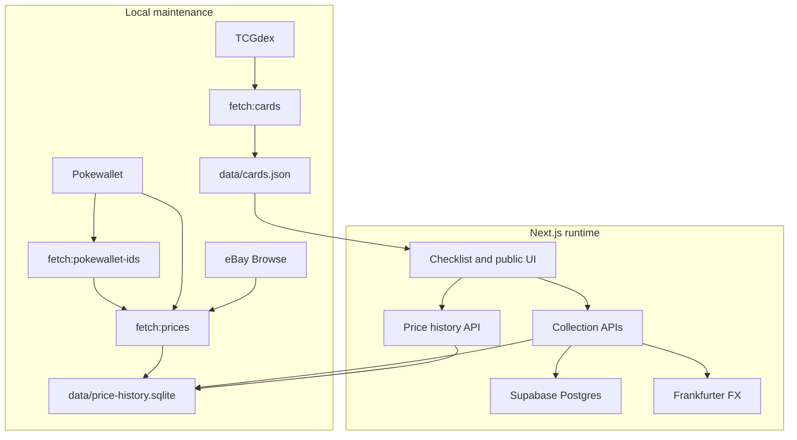

# Eevee Card Tracker

A personal **Next.js 16** application for tracking a physical Pokémon TCG collection focused on Eevee, every Eeveelution, and selected cameo cards.

The application has three persistent data layers:

- [`data/cards.json`](data/cards.json) — generated catalogue bundled into the application.
- **Supabase Postgres** — ownership rows for the configured user.
- [`data/price-history.sqlite`](data/price-history.sqlite) — current variant prices, FX metadata, and 31 days of price history.

Catalogue and price maintenance run from local scripts. The deployed application never calls TCGdex, Pokewallet, or eBay directly.

---

## Table of contents

- [Features](#features)
- [Architecture and data flow](#architecture-and-data-flow)
- [Runtime behavior](#runtime-behavior)
- [Catalogue pipeline](#catalogue-pipeline)
- [Pricing pipeline](#pricing-pipeline)
- [Variant and price rules](#variant-and-price-rules)
- [Display currency](#display-currency)
- [Database setup](#database-setup)
- [Environment variables](#environment-variables)
- [Getting started](#getting-started)
- [NPM scripts](#npm-scripts)
- [App routes and API](#app-routes-and-api)
- [Data files](#data-files)
- [Legacy Google Sheets migration](#legacy-google-sheets-migration)
- [Deployment](#deployment)
- [Security and privacy](#security-and-privacy)

---

## Features

- **Variant-level checklist** — every physical printing is a separate slot, with All, Owned, and Missing filters.
- **Search and filters** — search by card, set, number, variant, or cameo; filter by Eeveelution and set; optionally include cameo cards.
- **Collection statistics** — owned percentage, slot count, and estimated value in the selected display currency.
- **Responsive navigation** — sticky compact stats plus a floating back-to-top control on long checklist, public, and settings pages.
- **Card details** — large art, current value from `current_prices`, 30-day low/change and chart from `price_history`, full-size image view, and marketplace links.
- **Public showcase** — `/public` displays owned cards for the configured public user with search, filters, currency chips, and a read-only image modal.
- **Current and historical pricing** — Pokewallet market prices, explicit eBay listing medians, and protected manual prices.
- **Currencies** — USD, EUR, HUF, and GBP with one-hour cached Frankfurter rates and SQLite fallback metadata.
- **Cameo catalogue** — non-Eeveelution cards that visibly feature Eevee or an Eeveelution.
- **Regional and special variants** — Japanese/Chinese printings, stamps, cosmos, jumbo, prize-pack, and other explicit catalogue variants.

---

## Architecture and data flow


```mermaid
flowchart TB
  subgraph local [Local maintenance]
    tcgdex[TCGdex]
    pokewallet[Pokewallet]
    ebay[eBay Browse]
    fetchCards["fetch:cards"]
    fetchIds["fetch:pokewallet-ids"]
    fetchPrices["fetch:prices"]
    cardsJson["data/cards.json"]
    priceDb["data/price-history.sqlite"]
    tcgdex --> fetchCards --> cardsJson
    pokewallet --> fetchIds
    fetchIds --> fetchPrices
    pokewallet --> fetchPrices
    ebay --> fetchPrices
    fetchPrices --> priceDb
  end

  subgraph runtime [Next.js runtime]
    app[Checklist and public UI]
    collectionApi["Collection APIs"]
    historyApi["Price history API"]
    postgres[Supabase Postgres]
    frankfurter[Frankfurter FX]
    cardsJson --> app
    app --> collectionApi
    app --> historyApi
    collectionApi --> postgres
    collectionApi --> priceDb
    collectionApi --> frankfurter
    historyApi --> priceDb
  end
```

### What updates when

| Data | Storage | Update path | Production visibility |
|------|---------|-------------|-----------------------|
| Catalogue | `data/cards.json` | `fetch:cards` or catalogue sync scripts | Commit and redeploy |
| Ownership | Supabase `collection_items` | Checklist UI | Immediate API write |
| Current prices | SQLite `current_prices` | `fetch:prices` | Commit and redeploy |
| Price history | SQLite `price_history` | `fetch:prices` | Commit and redeploy |
| FX fallback | SQLite `price_meta` | `fetch:prices` | Commit and redeploy |
| Live FX | Frankfurter | Runtime API enrichment, cached one hour | Next API response |
| Display currency | Browser `localStorage` | Settings/currency controls | Immediate |

The same SQLite file supplies both card-tile prices and card-detail history. There is no longer a split between Google Sheets for current prices and SQLite for charts.

---

## Runtime behavior

### Authentication and ownership

The app is currently single-owner:

1. `APP_USERNAME` and `APP_PASSWORD` validate the login.
2. A signed, HTTP-only session cookie contains the configured `APP_USER_ID`.
3. On login, the app ensures that user exists in Supabase.
4. Ownership is stored by `(user_id, card_id, variant)` in `collection_items`.

`PUBLIC_COLLECTION_USER_ID` controls which user `/public` displays and defaults to `APP_USER_ID`.

### Catalogue

The runtime imports [`data/cards.json`](data/cards.json). Each card contains its authoritative variant list, images, set metadata, language, and optional `cameoOf` metadata. The UI expands cards into slot keys such as:

```text
base2-3:holo
30c-116:cosmos
mep-100:jumbo
```

Ownership, pricing, statistics, filtering, and charts all use these variant slots.

### Prices

[`lib/prices-provider.ts`](lib/prices-provider.ts) reads current prices from SQLite. Only when SQLite contains no prices and `USE_GOOGLE_SHEETS_FALLBACK=true` does it read the legacy Google Sheet.

[`next.config.mjs`](next.config.mjs) traces the SQLite file into the collection, public-collection, and price-history server functions. All three routes use the Node.js runtime because `better-sqlite3` is native.

---

## Catalogue pipeline

`npm run fetch:cards`:

1. Queries TCGdex for Eevee and each Eeveelution.
2. Excludes Pokémon TCG Pocket data.
3. Adds explicit references from [`data/included-cards.json`](data/included-cards.json).
4. Applies durable manual records from [`data/manual-cards.json`](data/manual-cards.json).
5. Merges external/master-set variants.
6. Applies variant corrections and cameo metadata.
7. Writes the generated [`data/cards.json`](data/cards.json).

Do not hand-edit `cards.json` for durable changes. Update an input file or mapping and rebuild.

### Included, manual, and cameo cards

- [`included-cards.json`](data/included-cards.json) tracks additional TCGdex records not found by Eeveelution name queries.
- [`manual-cards.json`](data/manual-cards.json) defines promos, custom IDs, regional cards, images, or cards not available from TCGdex.
- [`cameo-cards.json`](data/cameo-cards.json) is the authoritative cameo catalogue.
- [`cameo-resolution-report.json`](data/cameo-resolution-report.json) records how cameo source rows resolved.

Useful commands:

```bash
npm run cards:pick -- search "Blue's Tactics"
npm run cards:pick -- list
npm run build:cameo-cards
npm run sync:cameo-catalogue
npm run apply:catalogue-variants
```

---

## Pricing pipeline

### Phase A: resolve Pokewallet IDs

```bash
npm run fetch:pokewallet-ids -- --only-missing
```

This writes [`data/pokewallet-id-cache.json`](data/pokewallet-id-cache.json). A cache entry can have one default Pokewallet card ID or curated IDs per catalogue variant.

### Phase B: fetch prices

```bash
npm run fetch:prices
```

The provider planner resolves each slot in this order:

1. Existing manual price rows remain protected.
2. A matching [`data/ebay-price-mappings.json`](data/ebay-price-mappings.json) entry uses eBay Browse.
3. Remaining mapped cards use Pokewallet.

Pokewallet returns TCGplayer USD and Cardmarket EUR where available. Explicit eBay mappings calculate an active-listing median after query filtering and store the sample count and estimate metadata.

Each run:

- loads existing `current_prices`;
- skips fresh rows from the current date unless `--force` is supplied;
- preserves manual rows;
- writes current prices incrementally;
- fetches Frankfurter FX metadata;
- writes a daily history snapshot;
- prunes history to the newest 31 calendar dates.

After fetching production prices, commit only the tracked SQLite file:

```bash
git add data/price-history.sqlite
git commit -m "Update price history for YYYY-MM-DD"
git push
```

That push triggers a deployment containing the new current prices and chart history.

### Targeted fetches

```bash
npm run fetch:prices -- --cards 30c-116,mep-100
npm run fetch:prices -- --provider pokewallet
npm run fetch:prices -- --provider ebay
npm run fetch:prices -- --limit 100 --offset 0
npm run fetch:prices -- --force
```

The Pokewallet client self-paces against hourly and daily limits.

---

## Variant and price rules

- **Multi-variant cards** use strict per-variant lookups.
- **Single-variant cards** may use a controlled alias when provider naming differs from the catalogue.
- [`lib/variant-catalogue-fixes.ts`](lib/variant-catalogue-fixes.ts) contains targeted provider/storage/ownership migrations.
- [`lib/variant-labels.ts`](lib/variant-labels.ts) controls user-facing names and sort order.
- `normal`, `reverse`, `holo`, `firstEdition`, `cosmos`, `jumbo`, stamp variants, and other explicit keys can coexist.
- Orphan provider variants may be retained in SQLite for migration/audit purposes but are not catalogue slots.

Price records contain:

| Field | Meaning |
|-------|---------|
| `usd` / `eur` | Native market amount, nullable independently |
| `updated_at` | Provider observation date |
| `source` | `pokewallet`, `ebay`, or `manual` |
| `price_kind` | `market`, `active_listing_median`, or `manual` |
| `sample_count` | Number of accepted eBay listings, when applicable |
| `metadata_json` | Provider/mapping details for estimates |

---

## Display currency

Prices are stored natively in USD and/or EUR. HUF and GBP are calculated at display time.

| Display currency | Preferred amount | Fallback |
|------------------|------------------|----------|
| USD | Native USD | Convert native EUR |
| EUR | Native EUR | Convert native USD |
| HUF / GBP | EUR conversion path when EUR exists | USD conversion path |

The collection APIs request USD-based EUR/HUF/GBP rates from Frankfurter. Results are cached server-side for one hour. If Frankfurter fails, the app uses the last FX metadata committed in SQLite.

Historical points retain native USD/EUR values and are converted with the current runtime rates when rendered.

---

## Database setup

### Supabase Postgres

Apply the initial schema:

```bash
npm run db:migrate
```

[`supabase/migrations/001_initial.sql`](supabase/migrations/001_initial.sql) creates:

- `app_users`
- `collection_items`

RLS is enabled for future Supabase Auth policies. The current server-side Postgres connection is expected to have permission to access these tables.

### Price SQLite

[`data/price-history.sqlite`](data/price-history.sqlite) contains:

| Table | Purpose |
|-------|---------|
| `current_prices` | Current price per `(card_id, variant)` |
| `price_history` | Daily native price per `(card_id, variant, observed_date)` |
| `snapshot_runs` | Snapshot date, timestamp, and point count |
| `price_meta` | Last stored FX date and USD rate map |

Validate it with:

```bash
npm run verify:price-db
npm run test:price-db
```

Manual retention commands:

```bash
npm run prune:price-history
npm run prune:price-history -- --dry-run
npm run prune:price-history -- --days 31 --date 2026-09-19
```

---

## Environment variables

Copy [`.env.local.example`](.env.local.example) to `.env.local`. Local scripts load `.env` first, then `.env.local`.

Use Node.js 24, matching the `engines` field in [`package.json`](package.json).

### Runtime

| Variable | Required | Purpose |
|----------|----------|---------|
| `APP_USERNAME` | Yes | Single-owner login username |
| `APP_PASSWORD` | Yes | Single-owner login password |
| `SESSION_SECRET` | Yes in production | HMAC session signing key |
| `APP_USER_ID` | Yes | Stable UUID for the owner |
| `PUBLIC_COLLECTION_USER_ID` | No | Public showcase owner; defaults to `APP_USER_ID` |
| `DATABASE_URL` | Yes | Supabase/Postgres connection string |
| `SUPABASE_DB_URL` | Alternative | Used when `DATABASE_URL` is absent |
| `PGSSLMODE=disable` | No | Disable TLS only for a trusted local Postgres |
| `USE_GOOGLE_SHEETS_FALLBACK=true` | Migration only | Read legacy prices only when SQLite is empty |

### Local catalogue and pricing scripts

| Variable | Required | Purpose |
|----------|----------|---------|
| `POKEWALLET_API_KEY` | For Pokewallet scripts | ID resolution and price fetching |
| `EBAY_CLIENT_ID` / `EBAY_CLIENT_SECRET` | For mapped eBay slots | Browse API credentials |
| `EBAY_MARKETPLACE_ID` | No | Defaults to the configured marketplace |
| `POKEWALLET_MAX_PER_HOUR` | No | Hourly request cap, default 100 |
| `POKEWALLET_MAX_PER_DAY` | No | Daily request cap, default 1000 |
| `POKEWALLET_RATE_MARGIN` | No | Headroom below provider limits, default 1 |

### Legacy migration only

`GOOGLE_CLIENT_EMAIL`, `GOOGLE_PRIVATE_KEY`, and `GOOGLE_SHEET_ID` are needed only for migration or the optional empty-SQLite fallback. They are not part of the normal production data path.

`RESTORE_DATABASE_URL` must point to a local/test Postgres instance for `restore:user-db`; never point it at production.

Never commit real credentials, webhook URLs, database dumps, or `.env` files.

---

## Getting started

```bash
npm install

# Configure .env.local, then create the Postgres schema
npm run db:migrate

# Optional when rebuilding the bundled catalogue
npm run fetch:cards

# Resolve provider IDs and populate SQLite
npm run fetch:pokewallet-ids -- --only-missing
npm run fetch:prices

# Run locally
npm run dev
```

Open `http://localhost:3000/login`. The root route redirects to login.

### Migrating an existing Google Sheet

```bash
npm run migrate:from-sheets -- --dry-run
npm run migrate:from-sheets -- --replace-collection
```

This imports owned slots into Supabase, imports current prices into SQLite, and creates a price-history snapshot.

### Backup and restore

```bash
npm run backup:user-db
npm run restore:user-db -- backups/supabase/user-db-YYYY-MM-DD.sql.gz
```

Backup requires `pg_dump` and `gzip`. Restore requires `gzip`, `psql`, and a safe `RESTORE_DATABASE_URL`.

---

## NPM scripts

### Application and databases

| Script | Purpose |
|--------|---------|
| `dev`, `build`, `start`, `lint` | Standard Next.js lifecycle |
| `db:migrate` | Apply the Supabase/Postgres schema |
| `migrate:from-sheets` | One-time Sheet → Supabase + SQLite migration |
| `verify:price-db` | Verify SQLite schema, integrity, metadata, and latest snapshot |
| `backup:user-db` / `restore:user-db` | Postgres backup and safe restore |

### Catalogue

| Script | Purpose |
|--------|---------|
| `fetch:cards` | Rebuild generated catalogue from TCGdex and local inputs |
| `apply:catalogue-variants` | Reapply local/external variants without a network fetch |
| `cards:pick` | Search/list/remove explicit included TCGdex cards |
| `build:cameo-cards` | Generate cameo catalogue data from curated source rows |
| `sync:cameo-catalogue` | Sync cameo entries into included/manual catalogue inputs |
| `build:variant-price-mappings` | Regenerate the slot-to-price mapping inventory |
| `build:variant-mapping-checklist` | Produce the human review checklist |

### Pricing

| Script | Purpose |
|--------|---------|
| `fetch:pokewallet-ids` | Resolve catalogue cards to Pokewallet IDs |
| `fetch:prices` | Update SQLite current prices, FX metadata, and daily history |
| `fetch:rates` | Refresh only the SQLite `price_meta` FX fallback from Frankfurter |
| `prune:price-history` | Apply SQLite retention manually |
| `rebuild:cbb2c-map` / `seed:cbb2c-ids` | Maintain the Gem Pack Vol. 2 Pokewallet ID map |
| `migrate:current-prices` | Migrate legacy current-price rows to per-variant rows |
| `migrate:swsh197-prices` | Targeted historical data migration |

### Tests

The repository uses script-based checks rather than one umbrella test command. Important suites include:

```bash
npm run test:catalogue-slots
npm run test:cameo-catalogue
npm run test:variant-price-contract
npm run test:variant-catalogue-fixes
npm run test:variant-pokewallet-ids
npm run test:ebay-price-utils
npm run test:price-db
npm run test:price-history
npm run test:collection-db
npm run test:collection-enrich
npm run test:session-user
npm run test:display-price
```

Use `npm run test:pokewallet-prices -- --cards id1,id2` for a live provider smoke test.

---

## App routes and API

| Route | Authentication | Purpose |
|-------|----------------|---------|
| `/` | No | Redirect to `/login` |
| `/login` | No | Owner login |
| `/checklist` | Yes | Main editable collection tracker |
| `/settings` | Yes | Display-currency preference |
| `/public` | No | Read-only owned-card showcase |
| `POST /api/auth/login` | No | Validate credentials and set session |
| `POST /api/auth/logout` | No | Clear the session cookie and redirect to login |
| `GET /api/collection` | Yes | Ownership from Postgres + prices from SQLite + FX |
| `POST /api/collection` | Yes | Add/remove one `(card, variant)` ownership row |
| `GET /api/public-collection` | No | Configured public user collection + prices |
| `GET /api/price-history` | Yes | Up to 31 days for one card variant |

`GET /api/price-history` accepts:

| Parameter | Default | Notes |
|-----------|---------|-------|
| `cardId` | Required | Catalogue card ID |
| `variant` | `normal` | Internal variant key |
| `days` | `30` | Clamped to 1–31 |

---

## Data files

| File | Role |
|------|------|
| [`cards.json`](data/cards.json) | Generated runtime catalogue |
| [`manual-cards.json`](data/manual-cards.json) | Durable manual records and overrides |
| [`included-cards.json`](data/included-cards.json) | Additional TCGdex card references |
| [`cameo-cards.json`](data/cameo-cards.json) | Cameo metadata source of truth |
| [`cameo-resolution-report.json`](data/cameo-resolution-report.json) | Cameo resolution audit |
| [`pokewallet-id-cache.json`](data/pokewallet-id-cache.json) | Pokewallet default and per-variant IDs |
| [`ebay-price-mappings.json`](data/ebay-price-mappings.json) | Explicit eBay queries, filters, and estimate settings |
| [`variant-price-mappings.json`](data/variant-price-mappings.json) | Catalogue slot pricing/storage inventory |
| [`cbb2c-pokewallet-id-map.json`](data/cbb2c-pokewallet-id-map.json) | Gem Pack Vol. 2 ID seed |
| [`cbb4c-pokewallet-id-map.json`](data/cbb4c-pokewallet-id-map.json) | Gem Pack Vol. 4 ID/reference data |
| [`price-history.sqlite`](data/price-history.sqlite) | Runtime current prices, FX metadata, and history |
| `*External.json` | Master-set variant reference material used during catalogue merge |
| `prices.json`, `manual-prices.json` | Legacy migration inputs; not runtime sources |

SQLite backup files and Postgres dumps are local artifacts and must not be committed.

---

## Legacy Google Sheets migration

Google Sheets is no longer the normal collection or current-price backend.

It remains available for:

- one-time migration through `migrate:from-sheets`;
- optional current-price fallback only when SQLite is empty and `USE_GOOGLE_SHEETS_FALLBACK=true`;
- historical JSON → Sheet migration tools retained for compatibility.

The running app should use Supabase for ownership and SQLite for prices.

---

## Deployment

1. Create a Supabase/Postgres database and run `npm run db:migrate`.
2. Configure runtime variables in Vercel.
3. Push/import the repository and deploy.
4. Commit and redeploy after catalogue changes.
5. Commit and redeploy after price SQLite changes.

Required production values are `APP_USERNAME`, `APP_PASSWORD`, `SESSION_SECRET`, `APP_USER_ID`, and `DATABASE_URL` (or `SUPABASE_DB_URL`). `PUBLIC_COLLECTION_USER_ID` is optional.

Pokewallet/eBay credentials belong on the local maintenance machine, not Vercel.

---

## Security and privacy

- Session cookies are HTTP-only, `sameSite=lax`, and Secure in production.
- Database credentials and provider keys are server/local-script secrets and must never reach client code.
- `/public` and `/api/public-collection` intentionally expose the configured user’s owned cards and current prices without authentication.
- `/api/price-history` requires authentication.
- The app uses one configured credential pair; it does not provide public registration.
- Card art and marketplace links load third-party resources.

---

## Legal notice

Pokémon, card names, artwork, and set names are trademarks or property of their respective owners. This is an independent fan project.

- Card metadata: [TCGdex](https://tcgdex.dev/)
- Market data: [Pokewallet](https://www.pokewallet.io) and explicitly mapped eBay listings

Displayed values are estimates, not financial advice.
